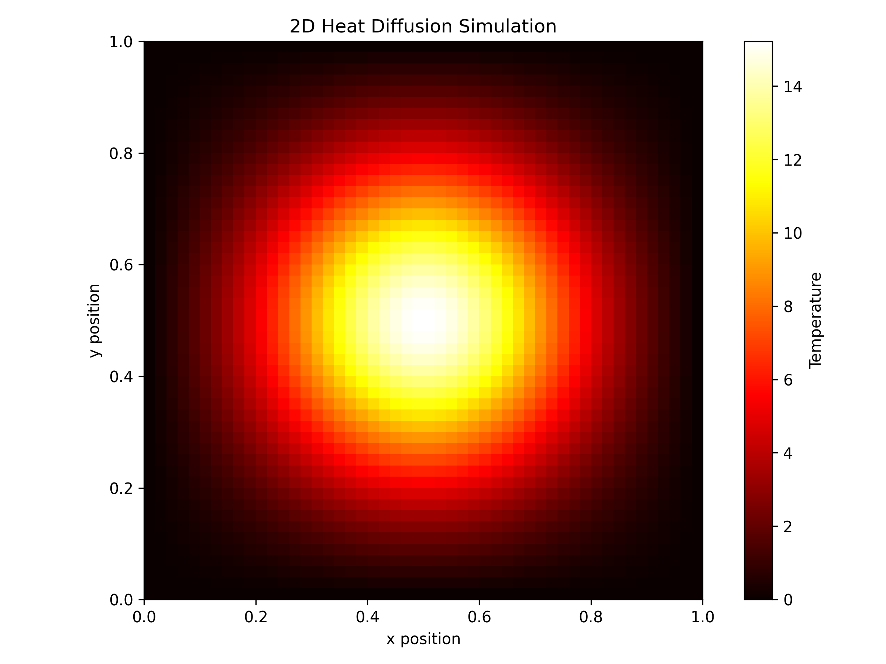

# 2D Heat Diffusion Solver

A Python-based simulation of heat spreading through a two-dimensional plate using the finite difference method.

## Project Overview

This project simulates how heat spreads through a 2D plate over time.

A hot region is placed in the center of the plate. The program then calculates how the heat moves from the hot region into the surrounding cooler areas.

## Physics

The simulation uses the 2D heat equation:

∂T/∂t = α(∂²T/∂x² + ∂²T/∂y²)

Where:

- T = Temperature
- t = Time
- α = Thermal diffusivity
- x = Horizontal position
- y = Vertical position

## Numerical Method

The spatial derivatives are calculated using the finite difference method.

The temperature is updated repeatedly over small time steps until the simulation is complete.

## Features

- 2D computational grid
- Finite difference method
- Explicit time integration
- Stability condition check
- Fixed-temperature boundary conditions
- Temperature visualization using Matplotlib

## Technologies

- Python
- NumPy
- Matplotlib

## Result

The simulation starts with a hot region in the center of the plate.

As time passes, the heat spreads outward into the surrounding cooler regions.

## Future Improvements

- Add animation
- Add different boundary conditions
- Add different materials
- Compare numerical and analytical solutions
- Improve computational efficiency

## Author

Daniel John
